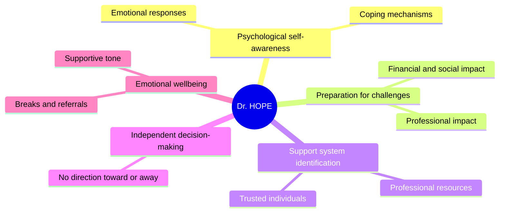
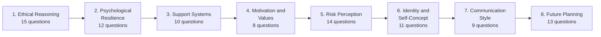
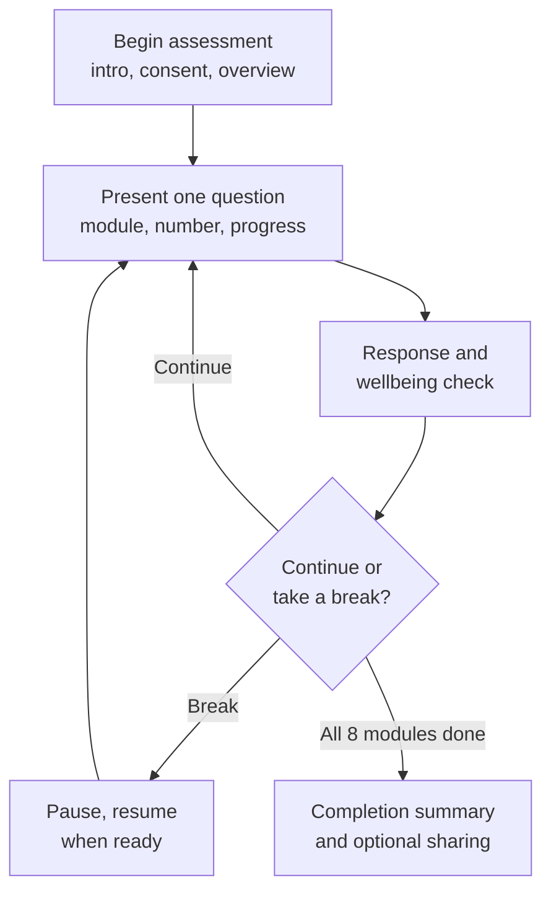
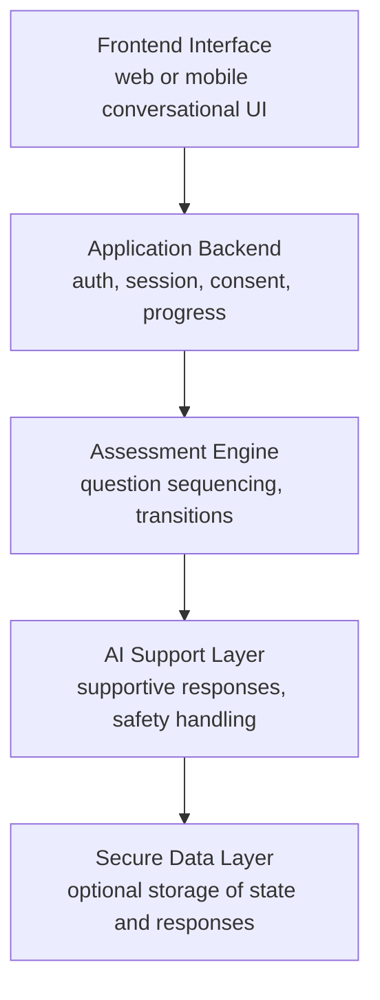
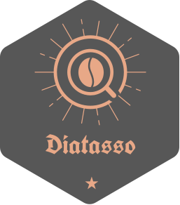

# Dr. HOPE

### Whistleblower Assessment Counselor

<div align="center">


**Helping Others Protect Everyone**

</div>

An AI-powered psychological self-assessment and support tool for individuals considering or engaged in whistleblowing, evaluating emotional preparedness, ethical reasoning, support systems, risk awareness, and long-term wellbeing.

## Overview

Dr. HOPE (Helping Others Protect Everyone) is a specialized AI-powered assessment counselor for individuals who are considering becoming whistleblowers, preparing to disclose wrongdoing, or navigating the psychological challenges of reporting misconduct.

Whistleblowing can carry significant personal, professional, emotional, and social consequences: uncertainty about the decision, fear of retaliation, financial concerns, strained professional relationships, and anxiety about long-term outcomes.

Dr. HOPE provides a structured space to explore these concerns through a 92-question psychological self-assessment, using a conversational model that encourages reflection on motivations, emotional resilience, ethical considerations, support networks, and tolerance for uncertainty.

Unlike conventional tools that produce numerical scores or readiness categories, Dr. HOPE emphasizes personal reflection and psychological preparedness without attempting to decide whether someone should become a whistleblower. It is an educational and supportive tool, not a clinical diagnostic instrument, a substitute for licensed psychological care, or a certification of suitability to report wrongdoing.

## Mission and Objectives

**Mission**: give individuals considering or engaged in whistleblowing accessible, structured psychological self-assessment and emotional support, helping them understand their circumstances, prepare for potential challenges, and identify resources for their wellbeing.



## Who This Is For

| User group | Intended use |
|---|---|
| Prospective whistleblowers | Exploring the personal and psychological implications of reporting wrongdoing |
| Active whistleblowers | Reflecting on wellbeing and support needs during an ongoing disclosure |
| Former whistleblowers | Exploring recovery, adaptation, and rebuilding stability |
| Support organizations | Offering a structured educational self-reflection resource |
| Counselors and support professionals | Using the framework as a supplementary discussion aid, with professional oversight |
| Researchers | Studying conversational self-assessment design, with consent and safeguards |

The system does not determine whether allegations are true, investigate misconduct, provide legal representation, or replace professional psychological evaluation.

## Core Assessment Framework

Dr. HOPE is organized into **eight modules totaling 92 questions**, each examining a distinct dimension of psychological preparedness.



| Module | Questions | Focus |
|---|---|---|
| 1. Ethical Reasoning and Moral Courage | 15 | Ethical dilemmas, competing obligations, loyalty, integrity |
| 2. Psychological Resilience Assessment | 12 | Responses to stress and conflict; coping and recovery |
| 3. Support Systems Evaluation | 10 | Availability and reliability of personal and professional networks |
| 4. Motivation and Values Assessment | 8 | Motivations, values, and expectations tied to whistleblowing |
| 5. Risk Perception and Management | 14 | Understanding consequences and resources for managing uncertainty |
| 6. Identity and Self-Concept | 11 | Self-understanding in relation to work, relationships, and values |
| 7. Communication and Disclosure Style | 9 | Communicating sensitive information, managing difficult conversations |
| 8. Future Planning and Adaptation | 13 | Long-term wellbeing, priorities, and capacity to adapt |

Example question (Module 1): *"You discover that a respected colleague has falsified information that could affect public safety. How would your relationship with this person influence the way you approach the situation?"* The goal is understanding the user's reasoning process, not identifying a correct answer. No module diagnoses conditions, classifies motivations as qualifying or disqualifying, or predicts legal outcomes.

## How Dr. HOPE Works

Dr. HOPE presents one question at a time, rather than a full questionnaire at once, keeping the process manageable and leaving room for reflection, clarification, and support.



**Initial setup**: Dr. HOPE introduces its purpose and structure, asks for a preferred name, gives an overview of the eight modules, states there are 92 questions and no final psychological score, and requires consent before beginning. Account-type collection should be optional for a standalone build.

**Progress tracking**: `Progress = (Completed Questions / 92) x 100`. At 46 completed questions, the assessment is 50 percent complete. The interface distinguishes answered questions from the one currently in progress.

**Response processing**: after each answer, the system acknowledges it and watches for a need for clarification, support, or a break, without treating an answer as evidence of a psychological disorder or moral deficiency.

## Emotional Support and Safety Features

**Break management**: breaks can be suggested on request, after significant distress, after completing a module, or after roughly 45 minutes of engagement.

**Crisis response**: if a user expresses immediate risk of self-harm or another serious safety concern, the normal assessment flow stops to prioritize safety and provide crisis resources. In the United States: call or text **988** for suicide and crisis support, or text **HOME to 741741** for the Crisis Text Line. The assessment resumes only when appropriate and at the user's discretion.

## Privacy, Confidentiality, and Data Protection

Whistleblower-related conversations may contain sensitive personal, professional, or organizational information, so privacy protection is a core design requirement, not an optional feature.

Recommended principles: collect only necessary information, avoid unnecessary identifying details about third parties, provide clear data-retention policies, and give users control over whether responses are saved or shared. Stored responses should use encryption, access controls, secure authentication, retention limits, and deletion mechanisms. Users should never be encouraged to upload confidential organizational documents, trade secrets, or identifying evidence just to complete a self-assessment.

**Important**: a conversational AI interface should never be described as providing legally privileged communication, guaranteed anonymity, or absolute confidentiality unless those protections are actually in place.

## Technical Architecture

A proposed architecture for a future standalone implementation, not a claim that these components already exist:



**Recommended repository structure:**

```
dr-hope/
├── README.md
├── LICENSE
├── CONTRIBUTING.md
├── SECURITY.md
├── PRIVACY.md
│
├── docs/
│   ├── project-overview.md
│   ├── assessment-framework.md
│   ├── ethical-guidelines.md
│   ├── safety-protocols.md
│   └── architecture.md
│
├── assessment/
│   ├── question-bank/
│   │   ├── module-01-ethics.json
│   │   ├── module-02-resilience.json
│   │   ├── module-03-support.json
│   │   ├── module-04-motivation.json
│   │   ├── module-05-risk.json
│   │   ├── module-06-identity.json
│   │   ├── module-07-communication.json
│   │   └── module-08-future.json
│   ├── assessment-engine/
│   └── progress-tracking/
│
├── src/
│   ├── frontend/
│   ├── backend/
│   ├── ai/
│   └── safety/
│
├── tests/
│
├── .env.example
└── package.json
```

The assessment question banks are kept separate from the conversational interface, so the interface or AI model can be updated without unintentionally changing the underlying questions.

## AI Behavioral Guidelines

- Present only one assessment question at a time and wait for the user's response.
- Maintain accurate module and overall progress tracking.
- Use supportive, nonjudgmental language without assuming the user's allegations are established facts.
- Respect the user's autonomy; never direct their whistleblowing decision.
- Never generate psychological scores, clinical diagnoses, or readiness certifications.
- Prioritize wellbeing and appropriate support when signs of serious distress arise.

These requirements should be enforced at the application level rather than relying only on model instructions: for example, the backend can enforce the one-question-at-a-time rule and calculate progress independently of the AI-generated response.

## Assessment Completion and Sharing

After all 92 questions, Dr. HOPE gives a completion acknowledgment and a factual summary (questions completed, modules covered, general areas explored), never a numerical score, a clinical diagnosis, or a recommendation to proceed with or abandon whistleblowing.

Sharing is always voluntary, with a clear explanation of what becomes accessible to the recipient. For a ChatGPT-based build, developers should verify the platform's current sharing behavior before documenting it as confidentiality-preserving. A standalone application could instead offer a dedicated export feature that lets users review and redact sensitive information before sharing.

## Ethical and Professional Limitations

Dr. HOPE is an informational and educational self-assessment tool. It does not provide professional psychological diagnosis, treatment, legal advice, or formal determinations of fitness or readiness to engage in whistleblowing. The framework should not be presented as a clinically validated psychometric instrument unless it has undergone appropriate validation research. Responses should never be used to make employment decisions, evaluate witness credibility, or determine whether allegations should be investigated. Any future research or clinical application needs additional professional review, safeguards, and consideration of relevant ethical and regulatory requirements.

## Future Development Roadmap

1. **Core assessment experience**: eight-module question bank, one-question-at-a-time interface, consent flow, accurate progress tracking.
2. **User experience improvements**: accessible interface options, session resumption, break reminders, user-controlled navigation.
3. **Privacy and security**: secure response storage, user-controlled deletion, privacy-preserving exports, documented data handling policies.
4. **Professional review**: input from qualified mental health professionals, whistleblower support specialists, and privacy and security experts.
5. **Accessibility and deployment**: multilingual support, mobile-friendly interfaces, accessible interaction patterns, deployment options for support organizations.

## Contributions

This repository does not currently accept external contributions. Changes to the psychological assessment content would need subject-matter review before joining the main question bank in any case.

## Project Vision

Dr. HOPE approaches AI-assisted psychological self-assessment with an emphasis on personal autonomy, emotional support, structured reflection, and responsible handling of sensitive information. Its long-term purpose is not to decide whether someone should disclose wrongdoing, but to help them understand their circumstances, identify support needs, and approach their own decisions with greater self-awareness.

Dr. HOPE: Helping Others Protect Everyone.

## 📄 License & Model

This project is **proprietary** and **All Rights Reserved**.

- No portion of this repository (concept documentation, source code, assessment questions, or associated materials) may be used, copied, modified, merged, published, distributed, sublicensed, hosted, or sold without prior written permission from DIATASSO LLC.
- This repository is published for portfolio and demonstration purposes only. It is not open source, and no license (MIT, Apache, GPL, or otherwise) is granted by publication or by forking/cloning.
- DIATASSO is a Tennessee-registered service mark, TM062328. The **Dr. HOPE** name, branding, and associated marks are trademarks of DIATASSO LLC, whether or not separately registered, and are not covered by any license grant even if one is later added to this repository.
- See [`LICENSE`](LICENSE) for full terms, [`BRANDING.md`](BRANDING.md) for brand usage, and [`TRADEMARKS.md`](TRADEMARKS.md) for trademark terms.

---

<div align="center">



### 🕊️ A DIATASSO LLC concept project

*AI-powered whistleblower psychological self-assessment tool*

---

### ⭐ Star this repository if Dr. HOPE interested you!

[](https://github.com/shadowdevnotreal/dr-hope/stargazers)
[](https://github.com/shadowdevnotreal/dr-hope/network)

**Made with 💜 by the DIATASSO Team**

<a href="https://www.buymeacoffee.com/diatasso" target="_blank"></a>

---

**Created and maintained by DIATASSO LLC**

DIATASSO is a Tennessee-registered service mark, TM062328. The company mark and brand assets are not covered by this repository's license. See [Branding](BRANDING.md) and [Trademarks](TRADEMARKS.md).

</div>
